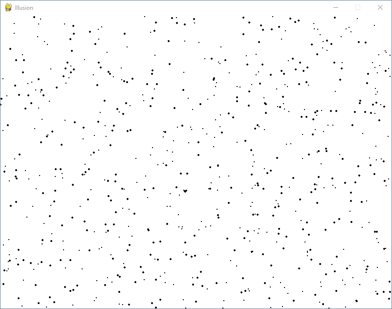
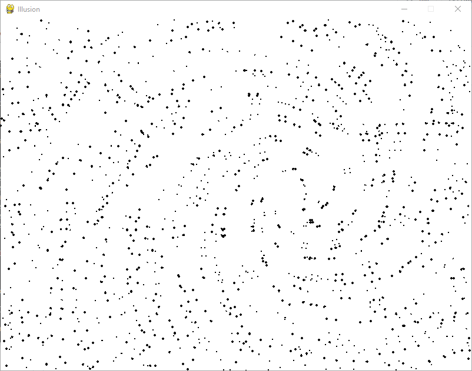

# Illusion
Illusion from scaled/rotated/translated dots inspired by video of Tim at Grand Illusions: https://www.youtube.com/watch?v=FmZN1ors__s.

 

## Running the code
**Option 1:** Running **** with python directly. This should be used if you have having issues with your anti-virus program flagging all PyInstaller builds as viruses.

This requires:
1. Have python 3.X installed (https://www.python.org/downloads/)
2. Have pygame installed (https://www.pygame.org/wiki/GettingStarted)
There are lots of tutorials for this.

After the above setup, running the file should just involve typing the command on the terminal in the format: `python-command illusion.py`
For example: `python3 illusion.py`

**Option 2:** Download and run the **** (created with PyInstaller, https://pyinstaller.org/en/stable/). Note that many antivirus programs may falsely flag this as a virus. There is nothing I can do about this, but you may be able to tell your antivirus software to ignore the problem (if you trust doing that).

**Option 3:** Download and run the **** (also created with PyInstaller, but different settings). Unzip, navigate into the folder, and run that illusion.exe. This might (or might not) have fewer problems with antivirus software.

## Commands:
* Arrow keys translate the image (up, down, left, right)
* 'a' and 'd' keys rotate the image ('a' = counter clockwise, 'd' = clockwise)
* 'w' and 's' keys zoom ('w' = zoom in, 's' = zoom out)
* 'x' resets to the original orientation
